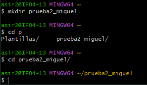
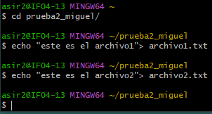
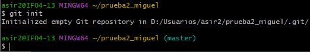
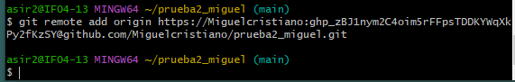
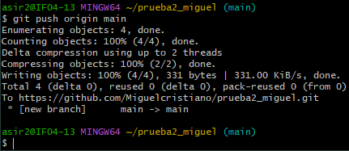
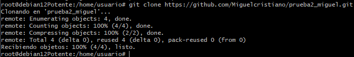

<h1>Ejercicio 14</h1>

<h4>1. Creacion de carpeta<h4>

<h4>2.Creacion de ficheros<h4>

<h4>3. Git init<h4>

<h4>4. Git remote add<h4>

<h4>5. Git Push<h4>

<h4>6. Git Clone<h4>

<h4>7. Archivo 3<h4>

<h4>8. Git Push<h4>

<h4>9. Git Pull <h4>

